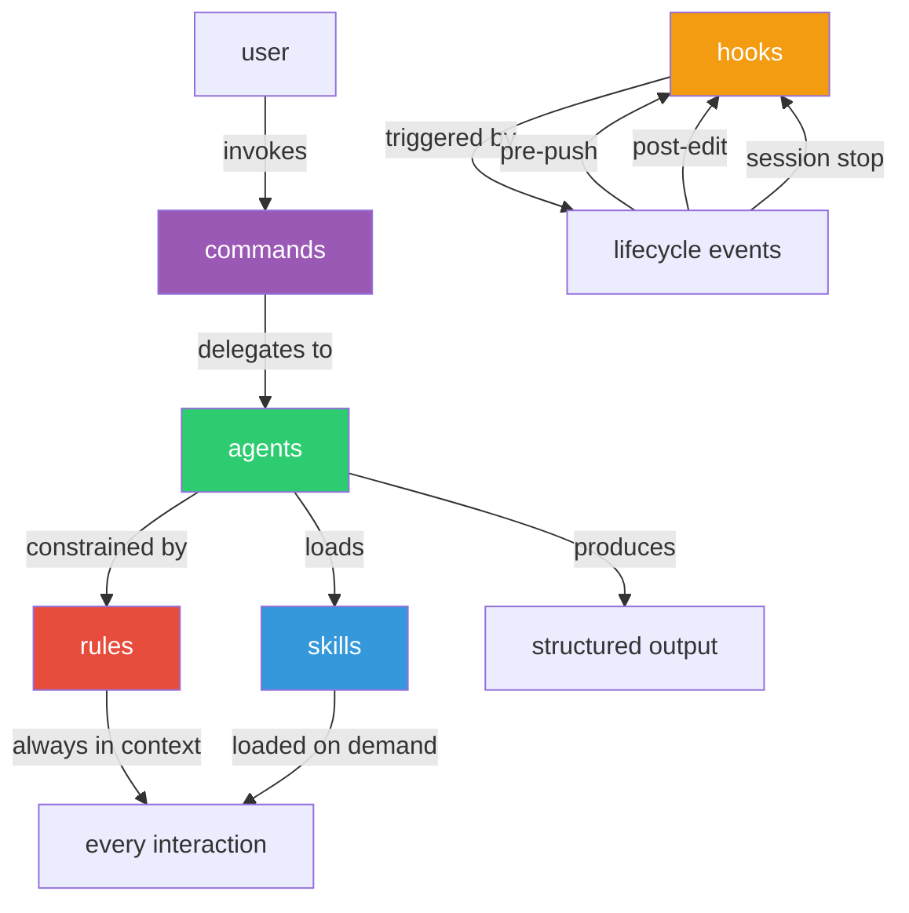

# dotclaude

a production-grade `~/.claude/` configuration for [claude code](https://docs.anthropic.com/en/docs/claude-code).

rules, skills, agents, commands, and hooks that enforce clean architecture, thorough testing, and disciplined engineering across every interaction.

## what this is

claude code reads configuration from `~/.claude/` to customize how it works. this directory supports five types of configuration files that compose together into a complete development workflow:

- **rules** — constraints loaded on every interaction (coding style, git discipline, security)
- **skills** — domain knowledge loaded on demand (testing patterns, framework conventions, API design)
- **agents** — autonomous subagents that handle complex multi-step tasks (code review, PR review, doc generation)
- **commands** — slash commands (`/pr-review`, `/doc-write`) that invoke agents with the right context
- **hooks** — shell scripts triggered by lifecycle events (pre-push checks, auto-formatting, debug audits)

the key insight: **rules constrain, skills teach, agents compose both.** rules are short and always loaded (they consume context window tokens on every interaction). skills are detailed and loaded only when relevant. agents reference both to produce structured, actionable output.

## quick start

```bash
git clone https://github.com/pradyummenon/dotclaude.git
cd dotclaude
./install.sh
```

the install script backs up your existing `~/.claude/` config, copies the new files, and prints next steps.

## what's included

### rules (always enforced)

| file | what it enforces |
|------|-----------------|
| `coding-style.md` | readability over cleverness, <40 line functions, meaningful names, guard clauses, composition over inheritance |
| `git-workflow.md` | conventional commits, identity management, PR conventions, branching strategy |
| `testing.md` | >80% coverage for new modules, regression tests for bug fixes, independent tests, descriptive names |
| `security.md` | no hardcoded secrets, pinned dependencies, parameterized queries, input validation |
| `performance.md` | no N+1 queries, cursor-based pagination, <200ms reads, lazy loading, bundle optimization |
| `code-hygiene.md` | no console.log/print/System.out, no debugger statements, no commented-out code, no orphan files |
| `agents.md` | when to delegate to subagents (>3 files review, >500 word docs, >3 tickets), structured output requirements |

### skills (on-demand knowledge)

| file | domain | when it loads |
|------|--------|--------------|
| `python-unit-test.md` | pytest patterns, fixtures, parametrization, async | generating/reviewing python unit tests |
| `python-integration-test.md` | testcontainers, httpx, respx, database fixtures | generating/reviewing python integration tests |
| `java-unit-test.md` | JUnit 5, Mockito, AssertJ, parameterized tests | generating/reviewing java unit tests |
| `java-integration-test.md` | Spring Boot Test, Testcontainers, WireMock | generating/reviewing java integration tests |
| `typescript-strict.md` | strict mode, discriminated unions, branded types, Zod | reviewing/writing typescript |
| `react-patterns.md` | functional components, hooks, server/client state, error boundaries | reviewing/writing react code |
| `nextjs-patterns.md` | App Router, server components, data fetching, middleware | reviewing/writing next.js code |
| `api-design.md` | REST conventions, status codes, pagination, error format | designing/reviewing APIs |
| `enterprise-python-review.md` | 10-dimension audit: error handling, types, async, security, DI, logging | enterprise python code review |
| `prd-writing.md` | PRD template: problem, user stories, scope, metrics, flows | writing product requirements |
| `trd-writing.md` | TRD template: system context, requirements, data model, APIs, deployment | writing technical requirements |
| `refactor-clean.md` | dead code detection, unused dependencies, orphan files, batch removal | refactoring and cleanup |

### agents (autonomous subagents)

| file | what it does |
|------|-------------|
| `code-reviewer.md` | detects project language, loads matching skills, produces structured review with severity-rated findings |
| `pr-review.md` | reviews PRs for breaking changes, code quality, architecture, SOLID principles |
| `design-reviewer.md` | reviews system/API design documents for architecture, security, performance, testability |
| `design-review.md` | reviews Figma designs for implementability, edge cases, design system consistency, accessibility |
| `doc-writer.md` | generates README, concept docs, and ADRs with example-driven content |
| `diagram-gen.md` | creates architecture, data flow, sequence, and class diagrams using mermaid (C4 model) |
| `test-writer.md` | polyglot test generator — detects language and produces appropriate unit/integration tests |
| `prd-reviewer.md` | reviews PRDs for completeness, user story quality, scope definition, measurable metrics |
| `trd-reviewer.md` | reviews TRDs for completeness, feasibility, and quality before engineering begins |
| `jira-ticket-creator.md` | converts raw descriptions into structured Jira tickets with acceptance criteria and estimates |
| `refactor-agent.md` | identifies dead code, unused dependencies, and orphan files with confidence scoring |

### commands (slash commands)

| command | what it triggers |
|---------|-----------------|
| `/pr-review` | PR review agent — diff against target branch, structured analysis |
| `/doc-write` | documentation generation — README, concept docs, ADRs, diagrams |
| `/diagram` | mermaid diagram creation — architecture, data flow, sequence, class |
| `/design-review` | Figma design review from engineering perspective |
| `/review-design` | system/API design document review |
| `/review-prd` | PRD review for completeness and quality |
| `/review-trd` | TRD review for feasibility and quality |
| `/review-enterprise-python` | 10-dimension enterprise Python audit |
| `/create-jira-tickets` | bulk Jira ticket creation from descriptions |
| `/refactor-clean` | dead code and dependency cleanup analysis |
| `/test-python-unit` | Python unit test generation/execution |
| `/test-python-integration` | Python integration test generation/execution |
| `/test-java-unit` | Java unit test generation/execution |
| `/test-java-integration` | Java integration test generation/execution |

### hooks (lifecycle automation)

| file | trigger | what it does |
|------|---------|-------------|
| `pre-push-gate.sh` | before `git push` | verifies git identity is set, checks for console.log/print/System.out in modified files |
| `post-edit-format.sh` | after writing JS/TS/Python files | auto-formats with prettier (JS/TS) or ruff/black (Python) |
| `pre-block-md-spam.sh` | before creating .md files | warns when creating markdown outside `docs/` or `.claude/` directories |
| `stop-console-audit.sh` | session end | audits workspace for leftover debug statements |

### settings template

`settings.example.json` configures:
- **MCP servers**: Sentry (error tracking) and Figma (design) integrations
- **hook registration**: connects shell scripts to lifecycle events
- **environment**: experimental features (agent teams)

to use it, copy to `~/.claude/settings.json` and:
1. replace `"npx"` with the full path if npx isn't on your PATH (e.g., `/opt/homebrew/opt/node@22/bin/npx`)
2. set `SENTRY_ACCESS_TOKEN` and `FIGMA_API_KEY` as environment variables
3. remove MCP server blocks you don't use

## architecture



**data flow**: user invokes a command -> command delegates to an agent -> agent detects project language from config files -> agent loads matching skills -> rules constrain every decision -> agent produces structured output with severity levels and file:line references.

## design philosophy

this setup is built on **constraint-based programming** — instead of telling the agent what to do step by step, you define boundaries it must stay within and knowledge it can draw from.

the core principles:

1. **rules are constraints, not instructions.** they restrict behavior ("never hardcode secrets", "no console.log in committed code"). they are short because they consume tokens on every interaction.

2. **skills are knowledge, not commands.** they teach patterns and conventions ("here's how to write a pytest fixture", "here's the REST API naming convention"). they are loaded only when relevant.

3. **agents compose both.** they have a role ("code reviewer"), a process ("detect language, load skills, analyze, report"), and an output format ("table with severity, file, issue, fix"). they reference rules for what to enforce and skills for how to evaluate.

4. **hooks automate what humans forget.** formatting, debug statement cleanup, identity verification — things that should happen every time but often don't.

5. **commands are thin entry points.** they parse user input and delegate to agents. the intelligence lives in the agent definition, not the command.

see [docs/philosophy.md](docs/philosophy.md) for the full treatment.

## what's NOT included

these directories exist in `~/.claude/` but are deliberately excluded:

| directory | why it's excluded |
|-----------|------------------|
| `config.json` | contains API key approvals |
| `settings.local.json` | machine-specific permission overrides |
| `projects/` | per-project session data and memory |
| `history.jsonl` | session history |
| `debug/`, `shell-snapshots/` | runtime debug logs |
| `telemetry/`, `statsig/` | analytics and feature flags |
| `backups/`, `cache/` | generated data |
| `todos/`, `paste-cache/`, `file-history/` | ephemeral workspace state |

## project structure

```
dotclaude/
  README.md                     # this file
  LICENSE                       # MIT
  .gitignore
  install.sh                    # copies files to ~/.claude/ with backup
  settings.example.json         # MCP servers + hook registration template
  rules/                        # 7 constraint files (always loaded)
  skills/                       # 12 knowledge files (loaded on demand)
  agents/                       # 11 agent definitions
  commands/                     # 14 slash command definitions
  hooks/                        # 4 shell scripts (lifecycle automation)
  docs/
    philosophy.md               # why this setup exists
    architecture.md             # how the pieces compose
    rules-vs-skills.md          # the key conceptual distinction
    agents-and-commands.md      # how the agent system works
    customization.md            # how to adapt for your stack
```

## requirements

- [claude code](https://docs.anthropic.com/en/docs/claude-code) CLI
- node.js (for MCP servers, if using sentry/figma integrations)
- language-specific tools (optional, for hooks):
  - JS/TS: prettier
  - Python: ruff or black
  - Java: (no auto-formatting hook, but skills reference Google Java Style)

## license

[MIT](LICENSE)
