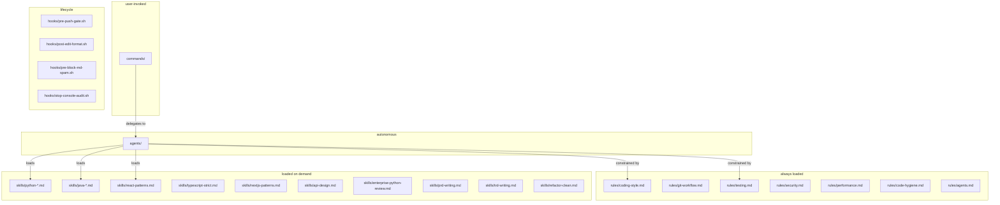
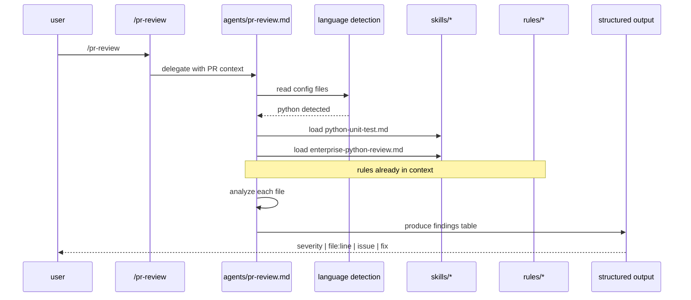
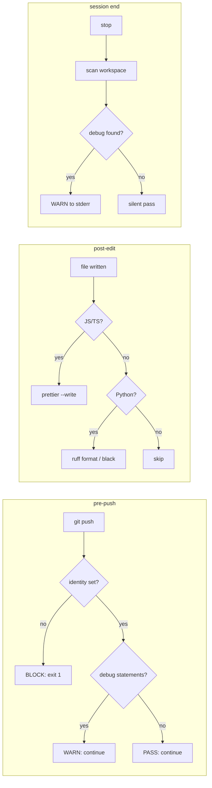

# architecture

## system overview

the dotclaude configuration is a layered system where each layer has a specific responsibility and loading strategy.



## loading strategy

### rules: always in context

rules are loaded into the system prompt for every interaction. this means:
- they consume context window tokens on every request
- they must be concise (10-25 lines each)
- total rule set: ~130 lines across 7 files
- they define what is required or forbidden, never how

### skills: demand-loaded by agents

skills are loaded when an agent determines they are relevant. the detection pattern:

```
agent receives task
  -> reads project config files (package.json, pom.xml, pyproject.toml)
  -> determines project language/framework
  -> loads matching skill files
  -> applies skill knowledge to the task
```

this means a Python project never wastes context on Java skills, and vice versa.

### agents: invoked by commands or delegation rules

agents are invoked in two ways:
1. **directly via commands**: user types `/pr-review`, command delegates to `agents/pr-review.md`
2. **via delegation rules**: `rules/agents.md` defines when to auto-delegate (e.g., "code review across >3 files -> use code-reviewer agent")

### hooks: triggered by lifecycle events

hooks are registered in `settings.json` and triggered automatically:

| event | trigger | hook |
|-------|---------|------|
| `PreToolUse` | before `git push` | `pre-push-gate.sh` |
| `PreToolUse` | before creating `.md` files | `pre-block-md-spam.sh` |
| `PostToolUse` | after writing/editing JS/TS/Python | `post-edit-format.sh` |
| `Stop` | session end | `stop-console-audit.sh` |

## data flow: code review example



## the structured output pattern

every agent produces output in a consistent format:

```
| severity | file:line | issue | recommendation |
|----------|-----------|-------|----------------|
| CRITICAL | auth.py:42 | SQL injection via string interpolation | use parameterized queries |
| HIGH | api.py:15 | no input validation on user_id | add pydantic model validation |
| MEDIUM | utils.py:88 | broad exception catch | catch specific exceptions |
```

severity levels: `CRITICAL`, `HIGH`, `MEDIUM`, `LOW`, `INFO`

this consistency means:
- output is scannable (you can skip LOW/INFO if pressed for time)
- findings are actionable (file:line takes you directly to the code)
- reviews are comparable (same format across different agents and languages)

## hook execution flow



## file dependency map

```
commands/pr-review.md
  -> agents/pr-review.md
    -> skills/python-unit-test.md (if python)
    -> skills/java-unit-test.md (if java)
    -> skills/typescript-strict.md (if typescript)
    -> skills/enterprise-python-review.md (if python)

commands/doc-write.md
  -> agents/doc-writer.md
    -> (no skill dependencies, uses project context)

commands/test-python-unit.md
  -> agents/test-writer.md
    -> skills/python-unit-test.md

commands/review-enterprise-python.md
  -> agents/code-reviewer.md
    -> skills/enterprise-python-review.md
```
